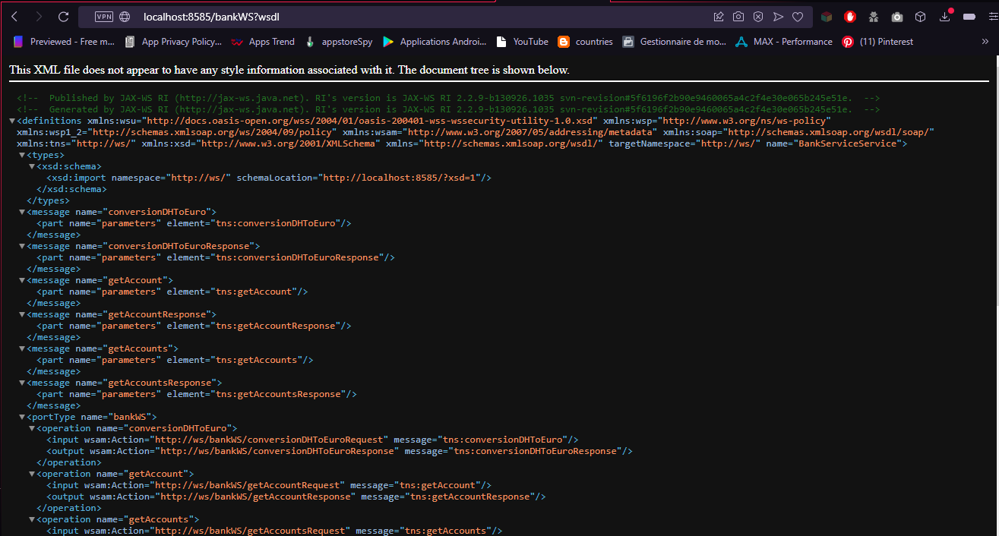
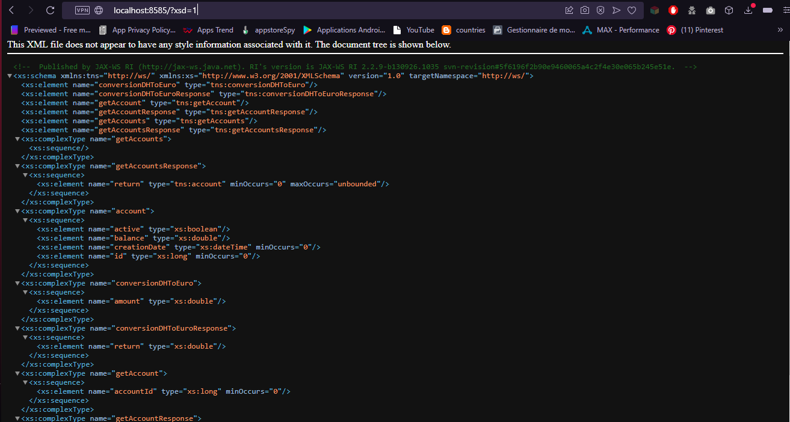

# Web Service SOAP with JaxWS

## Jax Web Service Server
```java
public class JaxWSServer {
    public static void main(String[] args) {
        String url = "http://0.0.0.0:8585/";
        Endpoint.publish(url, new BankService());
        System.out.println("Web service running in "+ url);
    }
}
``` 

## Account Class

```java
@XmlRootElement(name = "account")
@XmlAccessorType(XmlAccessType.FIELD)
public class Account {
@XmlAttribute
private Long id;
@XmlElement
private double balance;
private Date creationDate;
private boolean active;

    public Account() {
    }

    public Account(Long id, double balance, Date creationDate, boolean active) {
        this.id = id;
        this.balance = balance;
        this.creationDate = creationDate;
        this.active = active;
    }

    public Long getId() {
        return id;
    }

    public void setId(Long id) {
        this.id = id;
    }

    public double getBalance() {
        return balance;
    }

    public void setBalance(double balance) {
        this.balance = balance;
    }

    public Date getCreationDate() {
        return creationDate;
    }

    public void setCreationDate(Date creationDate) {
        this.creationDate = creationDate;
    }

    public boolean isActive() {
        return active;
    }

    public void setActive(boolean active) {
        this.active = active;
    }
}
``` 

## BankService Class
```java
@WebService(name = "bankWS")
public class BankService {
@WebMethod(operationName = "conversionDHToEuro")
public double conversion(@WebParam(name = "amount") double amount){
return amount / 11;
}

    public Account getAccount(@WebParam(name = "accountId") Long id){
        return  new Account(id,Math.random()*8000,new Date(), true);
    }

    public List<Account> getAccounts(){
        List<Account> accounts = new ArrayList<>();
        for (int i = 0; i < 10; i++) {
            accounts.add(new Account((long) (i + 1),Math.random()*8000,new Date(), true));
        }
      return accounts;
    }
}
``` 

## WSDL Schema



## XML Schema Definition



## Testing SOAP web service with SoapUI tool

### Create new project in SoapU


### Get the web services info from wsdl schema automatically


### SOAP Request for get account web service


### Get Account Response 


